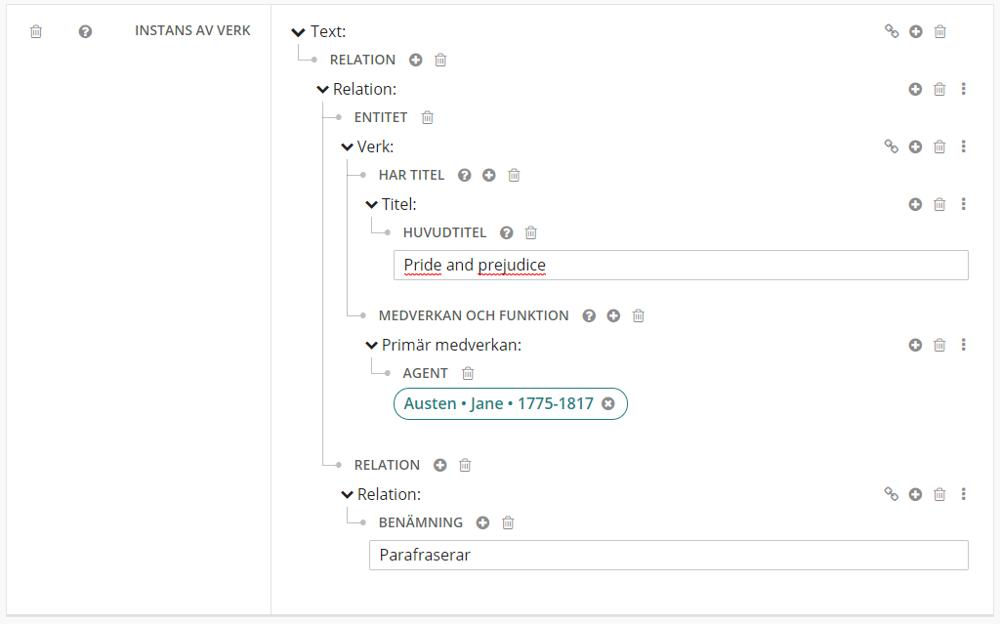
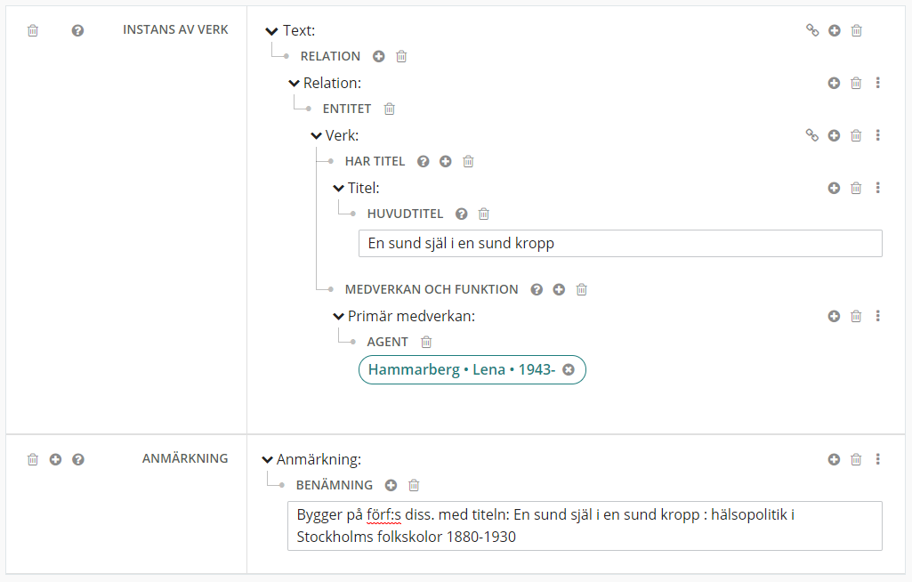
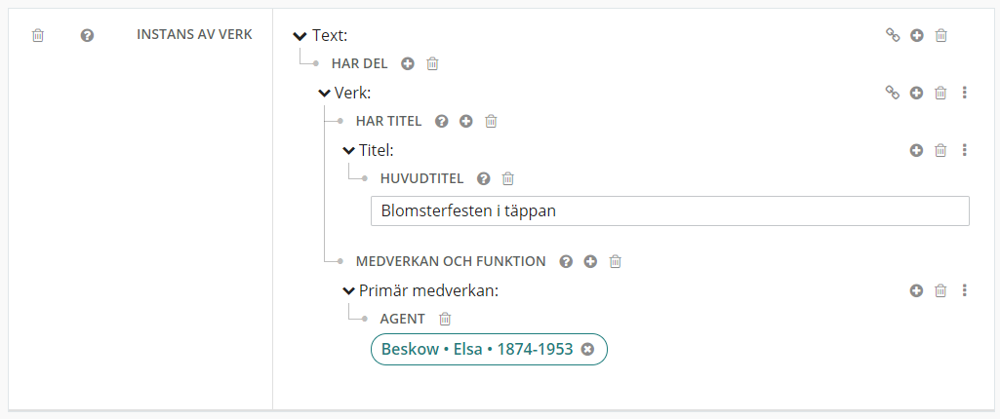

## Relationer till delar och verk 
(7XX)

700, 710 och 711 är komplicerade fält i MARC21 som kan uttrycka olika saker om en agent, medverkande, relationer, och att en instans innehåller flera verk. Den här hjälpen visar hur man skapar olika typer av relationer. 

Länka i första hand till befintliga auktioriteter för personer, organisationer och möten. Om det inte finns en auktoritet så kan du skapa en auktoritet. Se hjälptexterna för Agenter. [För personer](https://libris.kb.se/katalogisering/help/workflow-agent-person-new) Se även [hjälptexten Relationer till Agent](https://libris.kb.se/katalogisering/help/workflow-agent-org-instance).

*I de första versionerna av nya Libris bör man inte länka till eller skapa nya verk, det är under utveckling.*


[Relation till verk uttryckt genom text](#relation-till-verk-uttryckt-genom-text)

[Obestämd relation till verk](#obestämd-relation-till-verk)

[Ingående verk](#Ingående-verk)

[Relation till ett verk av en författare som ämnesord](#Relation-till-ett-verk-av-en-författare-som-ämnesord)

[Fler delfält](#Fler-delfält)

    

### Relation till verk uttryckt genom text 
Relation till ett verk av en författare (700 1/_ #i a  #d #t)
<br/>
Det finns fasta termer i RDA för att uttrycka en relation till ett verk och som motsvarar delfält i i Exportformatet, men det är ännu inte möjligt att länka till dessa i nya Libris. De kontrollerade relationsbeteckningarna tillämpas tills vidare restriktivt, eftersom det för närvarande saknas officiella svenska översättningar av RDA-termerna.

För att uttrycka relationen till ett verk som har ett samband med (men inte ingår i) den katalogiserade instansen:

 

* Öppna sidorutan Lägg till egenskaper under: Text
* Välj egenskapen Relation (Relationship)
* Välj typ Relation från rullgardinsmenyn
* Öppna sidorutan Lägg till egenskaper under: Relation och välj Entitet
  * Lägg till Entitet/Skapa lokal entitet/Verk
  * Lägg till egenskaper under Verk/Har titel/Titel/Huvudtitel och skriv in titeln
  * Lägg till egenskaper under Verk/Medverkan och funktion/Primär medverkan/Agent
  * Lägg till entitet och länka till auktoriserad namnform. Om en sådan inte finns Skapa lokal entitet, välj Person och fyll i uppgifterna
* Öppna sidorutan Lägg till egenskaper under: Relation och välj Relation
  * Lägg till Relation/Skapa lokal entitet
  * Lägg till egenskaper under: Relation och välj Benämning
  * Skriv in uppgiften. ```Exempel: Parafraserar```

 <br/>

### Obestämd relation till verk 
Om relationen är viktig att beskriva och inte kan beskrivas på annat sätt, gör en allmän anmärkning (500 #a)


 

* Öppna sidorutan Lägg till egenskaper under: Text
* Välj egenskapen Relation (relationship)
* Välj typ Relation från rullgardinsmenyn
* Öppna sidorutan Lägg till egenskaper under: Relation och välj Entitet
* Lägg till Entitet/Skapa lokal entitet/Verk
  * Lägg till egenskaper under Verk/Har titel/Titel/Huvudtitel och skriv in titeln
  * Lägg till egenskaper under Verk/Medverkan och funktion/Primär medverkan/Agent
  * Lägg till entitet och länka till auktoriserad namnform. Om en sådan inte finns Skapa lokal entitet, välj Person och fyll i uppgifterna
* Lägg till en anmärkning (Lägg till egenskaper under: Instans/Anmärkning (hasNote)/Anmärkning/Benämning) och skriv in uppgiften
<br/>```Exempel:Bygger på förf:s diss. med titeln: En sund själ i en sund kropp : hälsopolitik i Stockholms folkskolor 1880-1930```

 <br/>
 
### Ingående verk
För att skapa analytiska biuppslag på verk som ingår i den katalogiserade instansen (700 1/2 #a #d #t)


 
* Öppna sidorutan Lägg till egenskaper under Text:
* Välj egenskapen Har del (hasPart)
* Lägg till entitet/Skapa Lokal entitet/Verk
  * Lägg till egenskaper under Verk/Har titel/Titel/Huvudtitel och skriv in titlen
  * Lägg till egenskaper under Verk/Medverkan och funktion/Primär medverkan/Agent
  * Lägg till entitet och länka till autkoriserad namnform. Om en sådan inte finns, Skapa lokal entitet, välj Person och fyll i uppgifterna
 

<br/> 

### Relation till ett verk av en författare som ämnesord
För att lägga till en författares verk som ämne (600 1/_ #a #d #t)


* Öppna sidorutan Lägg till entitet inom egenskapen Ämne
* Välj Skapa lokalt entitet/Verk
  * Lägg till egenskaper under Verk/Har titel/Huvudtitel
  * Skriv in den föredragna titeln
  * Lägg till egenskaper under Verk/Medverkan och funktion/Primär medverkan/Agent
  * Lägg till entitet och länka till auktoriserad namnform. Om en sådan inte finns, Skapa lokal entitet, Välj Person och fyll i uppgifterna
    
###  Fler delfält
För att lägga till fler delfält under Verk/Har titel/Titel/Lägg till egenskaper under: Titel/:
  * Specificering i form av grupptitel (700 #k)
  * Delbeteckning (700 #n)
  * Deltitel (700 #p)
  
För att lägga till språk för det relaterade verket (700 #l):
* Lägg till egenskaper under Verk/Språk
  * Lägg till Språk/Skapa lokal entitet
  * Lägg till egenskaper under: Språk/Benämning
  * Skriv in språket i klartext 

  
 
